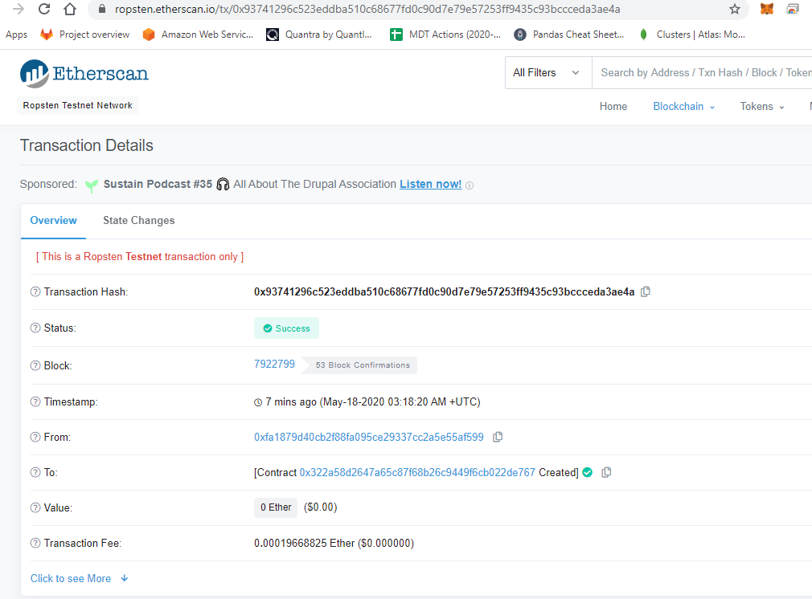
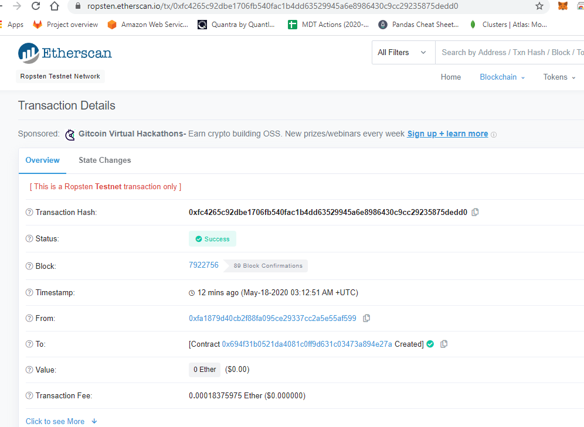
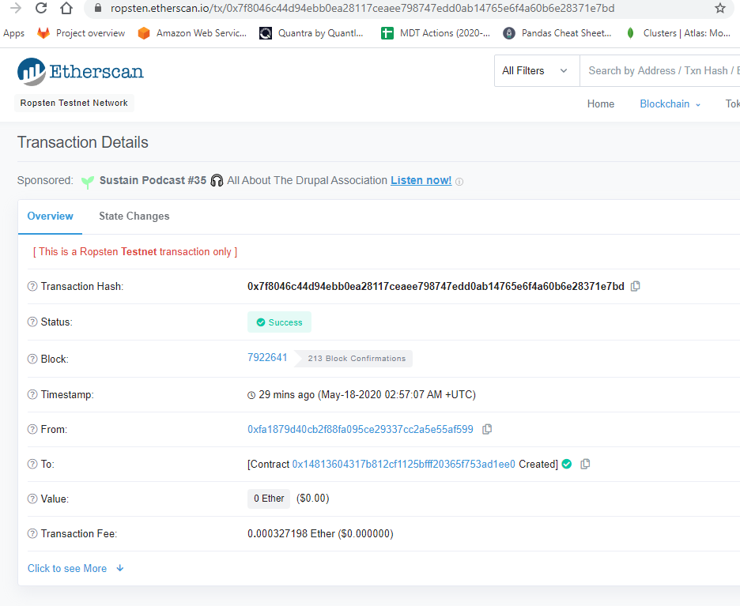

## AssociateProfitSplitter

This will accept Ether into the contract and divide the Ether evenly among the associate level employees. This will allow the Human Resources department to pay employees quickly and efficiently.

Deployed on Ropsten Testnet

Transaction Hash:
0x93741296c523eddba510c68677fd0c90d7e79e57253ff9435c93bccceda3ae4a

https://ropsten.etherscan.io/tx/0x93741296c523eddba510c68677fd0c90d7e79e57253ff9435c93bccceda3ae4a

# TieredProfitSplitter
In this contract, rather than splitting the profits between Associate-level employees, you will calculate rudimentary percentages for different tiers of employees (CEO, CTO, and Bob).

Deployed on Ropsten Testnet

Transaction Hash:
0xfc4265c92dbe1706fb540fac1b4dd63529945a6e8986430c9cc29235875dedd0 

https://ropsten.etherscan.io/tx/0xfc4265c92dbe1706fb540fac1b4dd63529945a6e8986430c9cc29235875dedd0

## DeferredEquityPlan

In this contract, we will be managing an employee's "deferred equity incentive plan" in which 1000 shares will be distributed over 4 years to the employee. We won't need to work with Ether in this contract, but we will be storing and setting amounts that represent the number of distributed shares the employee owns and enforcing the vetting periods automatically.

Deployed on Ropsten Testnet

Transaction Hash:
0x7f8046c44d94ebb0ea28117ceaee798747edd0ab14765e6f4a60b6e28371e7bd

https://ropsten.etherscan.io/tx/0x7f8046c44d94ebb0ea28117ceaee798747edd0ab14765e6f4a60b6e28371e7bd

